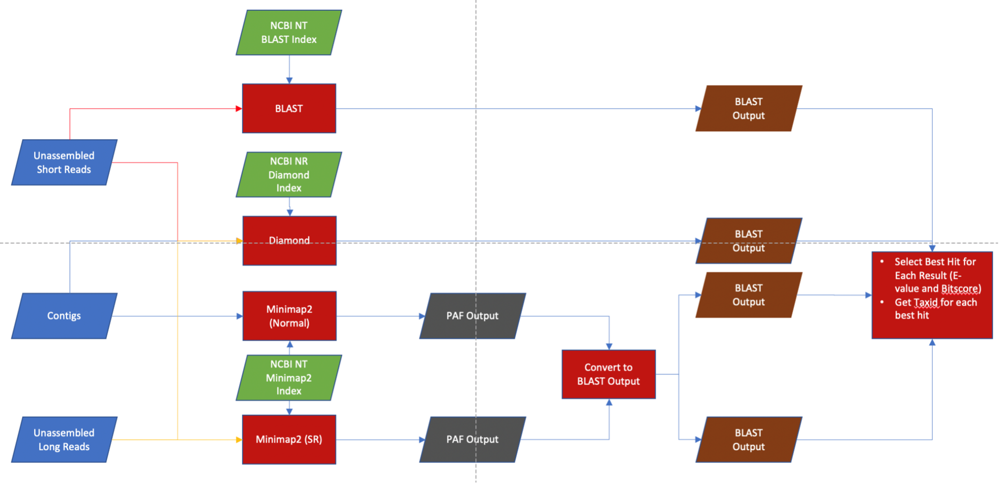

# Rapid Metatranscriptomics

A new and innovative meta-transcriptomics pipeline that takes in RNA-seq samples and rapidly performs quality control and quantification using small amounts of RAM and CPU cores. Utilises an innovative way of viewing quantification data using Krona tools to view the species identified within their samples within different taxon levels, which has even been modified to show alignment scores for each species and to filter out species based on their scores (available from: https://github.com/YasirKusay/Krona/tree/filters).

The program was written with 6 different subcommands (preprocessing, minimap_contig_alignment, minimap_long_read_alignment, blast_short_read_alignment, diamond_alignment and finalisation). The preprocessing step must be ran first, the alignment steps can be ran in parallel and the finalisation step must be run last.

This flowchart shows the steps involved in the preprocessing step.

This flowchart shows the steps involved in the alignment step.

## Installation.

The pipeline is available on TestPyPi and can be installed via: `pip install --extra-index-url https://test.pypi.org/simple/ rapid_metatranscriptomics`

Please ensure that you setup a fresh environment with python 3.6 and install cython version 0.26 prior to the installation of this pipeline.

## Setup

The pipeline requires other tools that must be installed prior to the utilisation of this tool. These include:
* minimap2*
* blast (available from https://ftp.ncbi.nlm.nih.gov/blast/executables/blast+/LATEST/)
* diamond*
* snap-aligner*
* fastp*
* samtools*
* megahit*
* seqtq*
* kraken2*
* rcf* (recentrifuge)
* bbtools (available from https://sourceforge.net/projects/bbmap/)

(\* indicates that you can install this program via conda, otherwise you must manually install the program and add it to your path.)

Furthermore, additional files/databases need to be downloaded or setup such as:
* The SortmeRNA rRNA database file (available from https://github.com/biocore/sortmerna/releases). We used smr_v4.3_default_db.fasta.
* The SNAP index generated using the complete human genome (the human genome we used is GRCh38_latest_genomic.fna and is available from https://www.ncbi.nlm.nih.gov/genome/guide/human/)
* The Kraken databases PLUS and STANDARD, (available from https://benlangmead.github.io/aws-indexes/k2)
* The minimap2 index generated using the NCBI NT sequences (available from https://ftp.ncbi.nlm.nih.gov/blast/db/FASTA/ as nt.gz). **WARNING! PAY CAREFUL ATTENTION TO THE SIZE OF THE NCBI NT SEQUENCES AS THE UNZIPPED SIZE IS (AS OF FEBRUARY 2023) NEARLY 1TB AND THE MINIMAP2 INDEX WILL BE AT LEAST 2.5 TIMES THE SIZE OF THAT!**
* The NCBI NT Blast index (download the files with nt.[0-9] from https://ftp.ncbi.nlm.nih.gov/blast/db/)
* The Diamond index built using the NCBI NR sequences (available from https://ftp.ncbi.nlm.nih.gov/blast/db/FASTA/ as nr.gz)
* Files that map sequence accessions to their taxonomic ids (available from https://ftp.ncbi.nlm.nih.gov/pub/taxonomy/accession2taxid/). We used dead_nucl.accession2taxid.gz, dead_wgs.accession2taxid.gz , nucl_gb.accession2taxid.gz, nucl_wgs.accession2taxid.EXTRA.gz and nucl_wgs.accession2taxid.gz to map accessions found in the NCBI NT database file and dead_prot.accession2taxid.gz and pdb.accession2taxid.gz to map accessions found in the NCBI NR database file.
* The taxdump file (available from: https://ftp.ncbi.nlm.nih.gov/pub/taxonomy/new_taxdump/) 
* Any control sequences and other sequences generated from the same lab environment as the input sequence (only if you want do perform decontamination)

**Important: This program needs to use the modified KronaTools software (for the preprocessing and finalisation steps) and must be added to the path prior to the utilisation of the program.**
**Also, make sure that you keep an eye out on the index sizes as they are massive and can exceed disk space.**